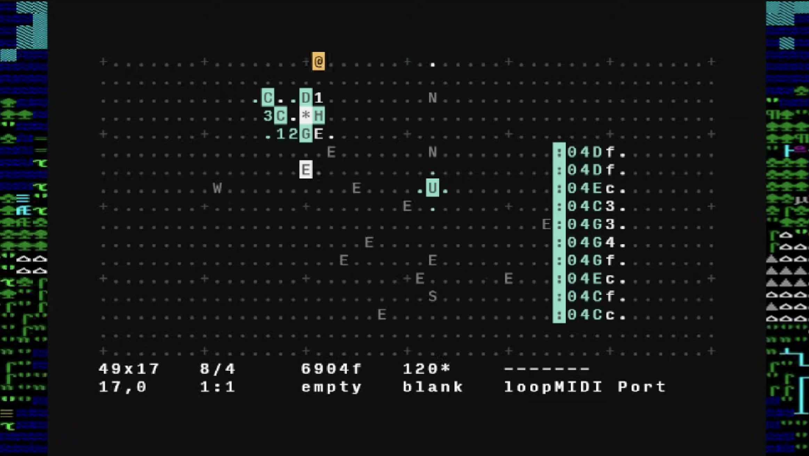

*[Orca](https://github.com/hundredrabbits/Orca) - livecoding environment
(reminds me of commit history)* 

# GitHub Worklog

A CLI tool that fetches your daily GitHub commits, uses an LLM to summarize them into meaningful bullet points, and maintains a running log of your work.

## Features

- Fetches all commits across all your repositories for a given day
- Summarizes commits using Claude (cloud) or Ollama (local)
- Maintains a single markdown file with all daily recaps
- Supports automated daily runs via macOS launchd

## Installation

### Prerequisites

- Rust (install via [rustup](https://rustup.rs/))
- [just](https://github.com/casey/just) command runner (`brew install just` or `cargo install just`)
- **One of:**
  - An Anthropic API key for Claude summarization ([get one here](https://console.anthropic.com/))
  - Ollama installed locally for free local summarization

### Setup

```bash
cp .env.example .env   # Then edit with your credentials
just build
```

## Usage

```bash
just              # Show all available commands
just preview      # Preview today's recap without saving
just today        # Generate today's recap
just generate 2026-01-07  # Generate for a specific date
just week         # Generate for the past 7 days
just config       # View configuration
```

### CLI Flags

```bash
# Switch provider on the fly
github-worklog today --provider ollama
github-worklog today --provider claude

# Use a different Ollama model
github-worklog today --provider ollama --ollama-model llama3.2:3b
```

## Output Format

```markdown
**09/01/26**

- Built MIDI clock sync for Orca → Ableton bridge, fixed drift issues on long sessions
- Added grain density controls to the generative ambient patch
- Pushed dark mode tweaks for the vinyl catalog app

---

**08/01/26**

- Shipped modular synth patch manager with Eurorack preset sharing
- Fixed audio buffer underruns in the lo-fi tape emulation plugin
```

## Automated Daily Runs (macOS)

```bash
just install-scheduler   # Install launchd job (runs daily at midnight)
just scheduler-status    # Check if scheduler is running
just logs                # View scheduler logs
just cron                # Run manually (generate + commit + push)
just uninstall-scheduler # Remove the scheduler
```
